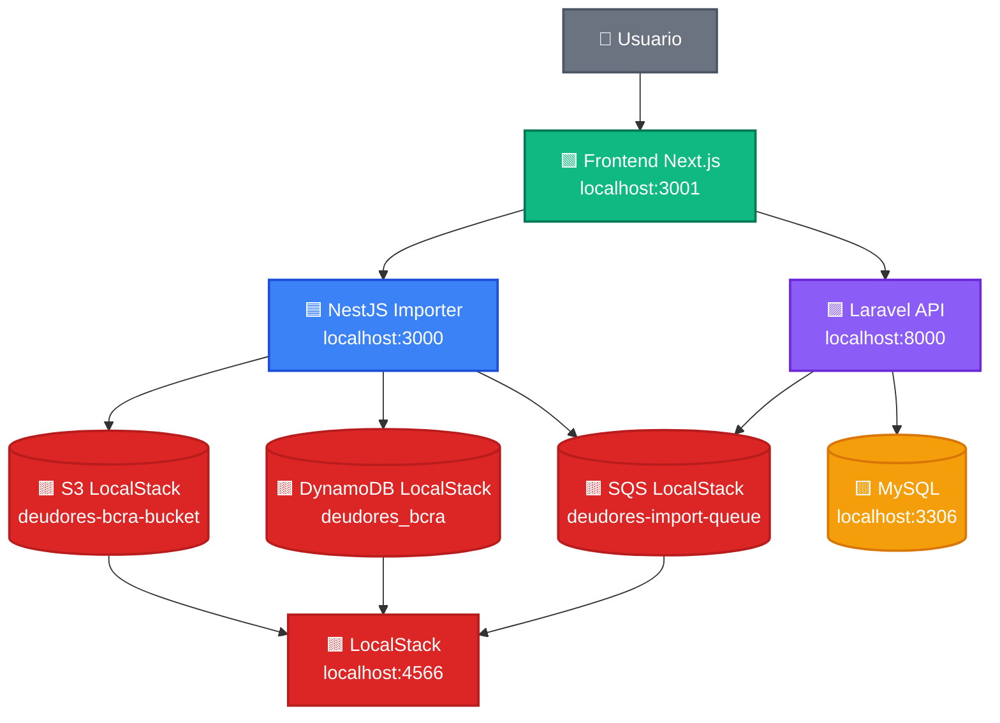
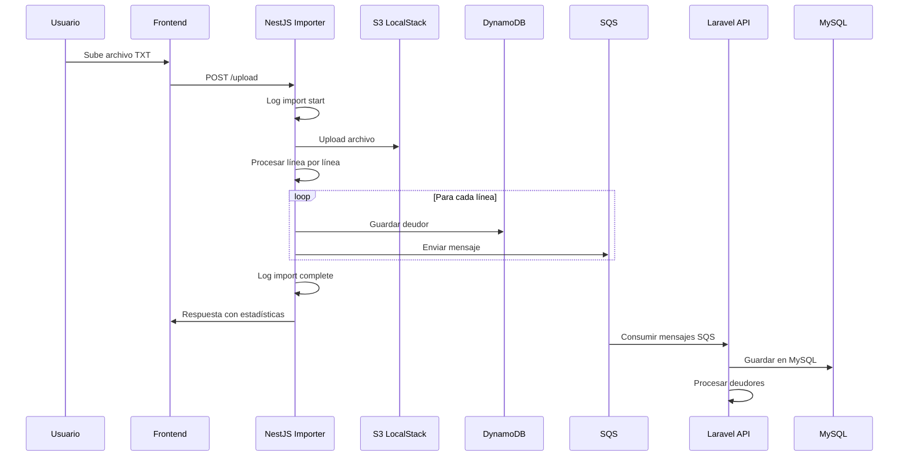
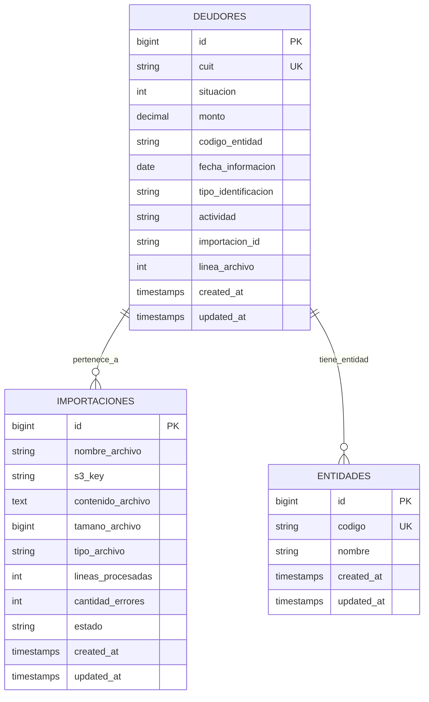
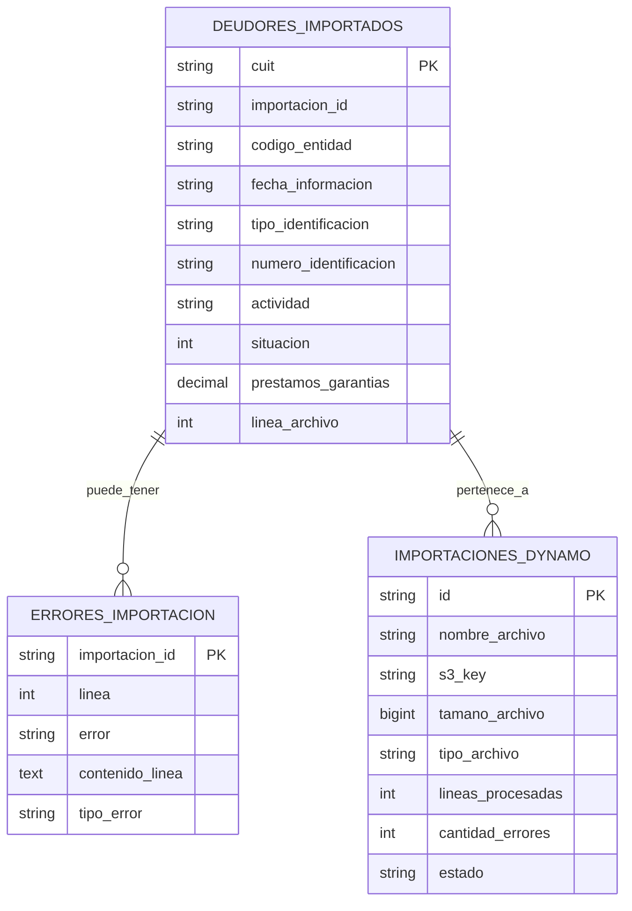
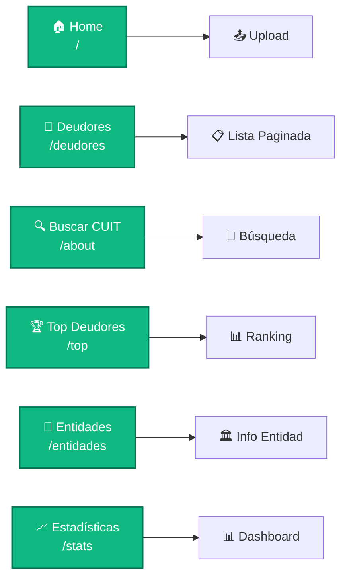
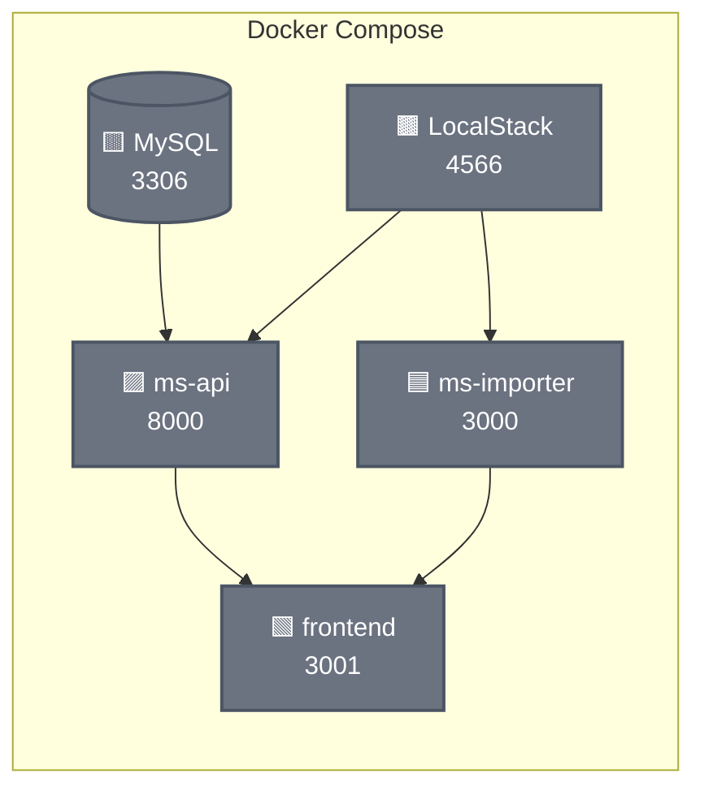
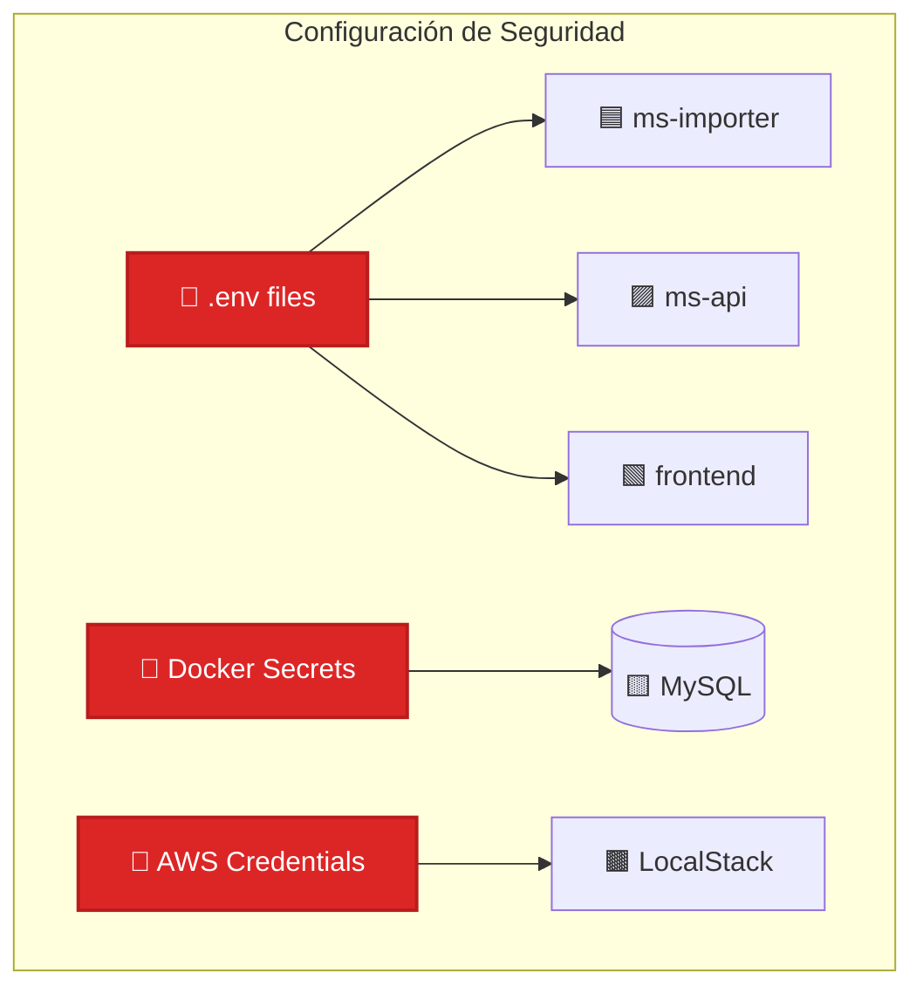

# 🏗️ Arquitectura del Sistema - Wayni Móvil Challenge

## 📊 Diagrama de Arquitectura General

## 🔄 Flujo de Procesamiento de Archivos

## 🗄️ Modelo de Datos

### MySQL (Laravel API)

### DynamoDB (NestJS Importer)

## 🌐 Endpoints y Rutas

### Frontend (Next.js)

## 🔧 Configuración de Servicios

### Docker Compose

## 🚀 Tecnologías Utilizadas

### Frontend
- **Next.js 14** - Framework React
- **TypeScript** - Tipado estático
- **Tailwind CSS** - Estilos
- **Radix UI** - Componentes
- **React Hook Form** - Formularios

### Backend
- **Laravel 11** - API REST (ms-api)
- **NestJS** - Microservicio importer
- **PHP 8.2** - Laravel
- **Node.js 20** - NestJS
- **TypeScript** - NestJS

### Bases de Datos
- **MySQL 8.4** - Datos relacionales
- **DynamoDB** - Datos NoSQL (LocalStack)

### Infraestructura
- **Docker** - Contenedores
- **Docker Compose** - Orquestación
- **LocalStack** - Servicios AWS simulados
- **S3** - Almacenamiento archivos
- **SQS** - Colas de mensajes

### Herramientas
- **Git** - Control de versiones
- **GitHub** - Repositorio
- **ESLint** - Linting
- **Prettier** - Formateo
- **Swagger** - Documentación API

## 🔒 Seguridad y Configuración

---

*Diagramas generados con Mermaid - Arquitectura del sistema Wayni Móvil Challenge* 