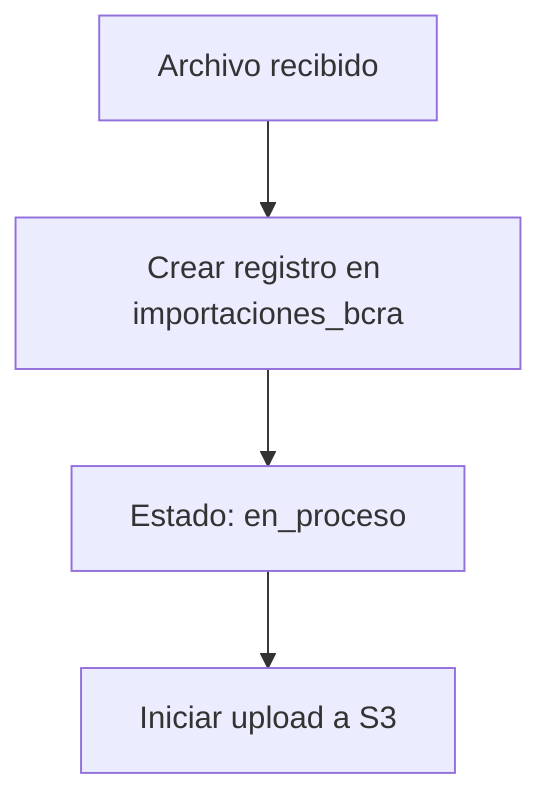
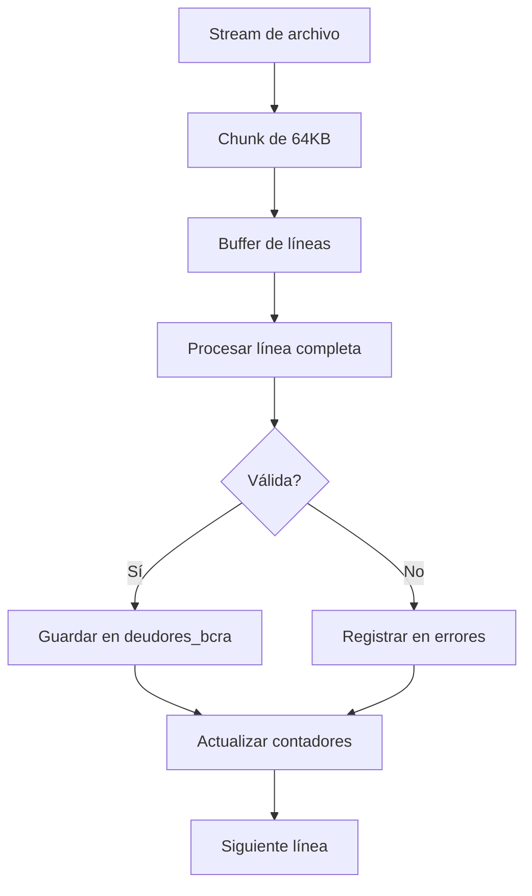
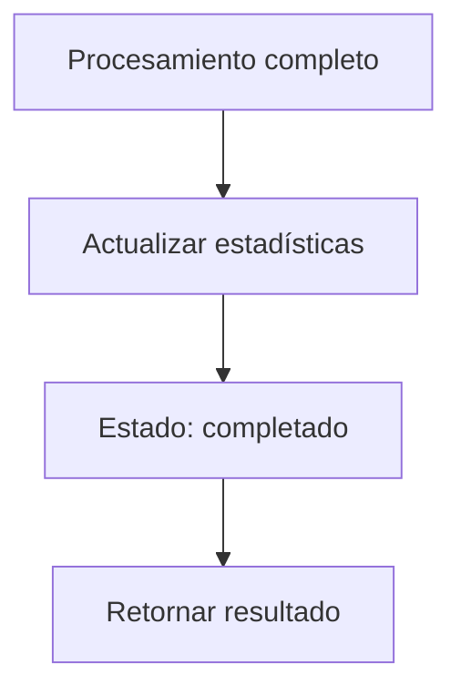

# 📤 Módulo Upload - Procesamiento de Archivos BCRA

Este módulo maneja la carga y procesamiento de archivos del BCRA (Banco Central de la República Argentina) con información de deudores. **Soporta archivos de hasta 10GB** con procesamiento por streaming para máxima eficiencia y escalabilidad.

## 🚀 Características Principales

### ✅ **Procesamiento de Archivos Gigantes**
- **Streaming real**: Procesa archivos línea por línea sin cargar todo en memoria
- **Soporte hasta 10GB**: Optimizado para archivos de gran tamaño
- **Chunks de 64KB**: Procesamiento eficiente por fragmentos
- **Upload multiparte a S3**: Subida optimizada para archivos grandes

### ✅ **Auditoría Completa**
- **Archivo crudo**: Almacenamiento en S3 para trazabilidad
- **Datos importados**: Registro detallado en DynamoDB
- **Log de errores**: Captura de errores por línea con contexto
- **Estadísticas**: Métricas de procesamiento y rendimiento

### ✅ **Resiliencia**
- **Manejo de errores**: Continuación del proceso ante líneas inválidas
- **Recuperación**: Estado de importación actualizable
- **Logging detallado**: Trazabilidad completa del proceso

## 📊 Arquitectura de Datos

### Tablas DynamoDB

#### 1. `importaciones_bcra` - Registro de Importaciones
```typescript
{
  id: string;                    // PK - UUID único
  nombreArchivo: string;         // Nombre original del archivo
  fechaImportacion: string;      // ISO timestamp
  estado: 'en_proceso' | 'completado' | 'error';
  cantidadRegistros: number;     // Líneas procesadas exitosamente
  cantidadErrores: number;       // Líneas con error
  s3Key: string;                 // Ubicación en S3
  tamanoArchivo: number;         // Tamaño en bytes
  tipoArchivo: string;           // MIME type
}
```

#### 2. `deudores_bcra` - Datos Importados
```typescript
{
  cuit: string;                  // PK - Número de identificación
  importacionId: string;         // GSI - Referencia a importación
  codigoEntidad: string;         // Campo 1 del archivo
  fechaInformacion: string;      // Campo 2 del archivo
  tipoIdentificacion: string;    // Campo 3 del archivo
  numeroIdentificacion: string;  // Campo 4 del archivo
  actividad: string;             // Campo 5 del archivo
  situacion: number;             // Campo 6 del archivo
  prestamosGarantias: number;    // Campo 7 del archivo
  fechaImportacion: string;      // Timestamp de importación
  lineaArchivo: number;          // Número de línea en archivo original
}
```

#### 3. `importaciones_errores` - Log de Errores
```typescript
{
  id: string;                    // PK - UUID único
  importacionId: string;         // GSI - Referencia a importación
  linea: number;                 // Número de línea con error
  error: string;                 // Descripción del error
  contenidoLinea?: string;       // Contenido de la línea problemática
  timestamp: string;             // ISO timestamp
  tipoError: 'parsing' | 'validacion' | 'persistencia' | 'otro';
}
```

## 🔄 Flujo de Procesamiento

### 1. **Inicio de Importación**


### 2. **Procesamiento por Streaming**


### 3. **Finalización**


## 📋 Formato del Archivo BCRA

### Estructura de Línea (Longitud Fija: 41 caracteres)

| Campo | Nombre | Tipo | Longitud | Posiciones | Ejemplo |
|-------|--------|------|----------|------------|---------|
| 1 | Código de entidad | Numérico | 5 | 0-5 | `00123` |
| 2 | Fecha de información | Numérico | 6 | 5-11 | `202311` |
| 3 | Tipo de identificación | Numérico | 2 | 11-13 | `02` |
| 4 | Número de identificación | Carácter | 11 | 13-24 | `0345678901` |
| 5 | Actividad | Numérico | 3 | 24-27 | `AAA` |
| 6 | Situación | Numérico | 2 | 27-29 | `01` |
| 7 | Préstamos / Garantías | Numérico | 12 | 29-41 | `210000000012` |

### Ejemplo de Línea Completa
```
00123020231111020345678901AAA012100000000123400000000000000000000000000000000000000000000000000000000000000000000000000000000000000000000000000000000000000000000000000000000000000000000000000000000000000000000000000000000000000000000000000000000
```

## 🛠️ API Endpoints

### POST `/upload`

**Descripción**: Sube y procesa un archivo BCRA

**Parámetros**:
- `file`: Archivo .txt (hasta 10GB)

**Respuesta Exitosa** (201):
```json
{
  "message": "Archivo procesado exitosamente",
  "processedLines": 1000000,
  "s3Key": "bcra-files/2024-01-15T10-30-45-123Z-archivo.txt",
  "importacionId": "uuid-importacion",
  "cantidadErrores": 5,
  "tamanoArchivo": 5368709120,
  "tiempoProcesamiento": 45000
}
```

**Códigos de Error**:
- `400`: Archivo inválido o no proporcionado
- `413`: Archivo demasiado grande (>10GB)
- `500`: Error interno del servidor

## ⚙️ Configuración

### Variables de Entorno
```env
# AWS/LocalStack
AWS_ENDPOINT=http://localhost:4566
AWS_REGION=us-east-1
AWS_ACCESS_KEY_ID=test
AWS_SECRET_ACCESS_KEY=test

# Límites de archivo
MAX_FILE_SIZE=10737418240  # 10GB en bytes
CHUNK_SIZE=65536           # 64KB en bytes
```

### Configuración de S3
- **Bucket**: `deudores-bcra-bucket`
- **Upload multiparte**: 5MB por parte
- **Concurrencia**: 4 partes simultáneas

## 📈 Métricas y Monitoreo

### Métricas de Rendimiento
- **Tiempo de procesamiento**: Milisegundos totales
- **Líneas por segundo**: Velocidad de procesamiento
- **Tasa de error**: Porcentaje de líneas con error
- **Uso de memoria**: Consumo durante procesamiento

### Logs Estructurados
```json
{
  "level": "info",
  "message": "Archivo procesado exitosamente",
  "importacionId": "uuid",
  "processedLines": 1000000,
  "cantidadErrores": 5,
  "tiempoProcesamiento": 45000,
  "tamanoArchivo": 5368709120
}
```

## 🧪 Testing

### Tests de Integración
```bash
# Ejecutar tests completos
npm run test:e2e

# Test específico de upload
npx jest test/upload.e2e-spec.ts
```

### Archivos de Prueba
- `test-bcra-file.txt`: Archivo de ejemplo (3 líneas)
- `test-invalid-file.txt`: Archivo con errores (generado dinámicamente)

## 🚨 Manejo de Errores

### Tipos de Error
1. **Parsing**: Línea mal formateada o incompleta
2. **Validación**: Datos fuera de rango esperado
3. **Persistencia**: Error al guardar en DynamoDB
4. **Otro**: Errores no categorizados

### Estrategia de Recuperación
- **Continuación**: El proceso continúa ante errores de línea individual
- **Logging**: Todos los errores se registran con contexto completo
- **Estadísticas**: Conteo de errores en tiempo real
- **Estado**: Actualización del estado de importación

## 🔧 Optimizaciones

### Para Archivos Grandes
- **Streaming**: Procesamiento línea por línea sin cargar en memoria
- **Chunks**: Procesamiento por fragmentos de 64KB
- **Upload multiparte**: Subida eficiente a S3
- **Concurrencia**: Múltiples operaciones simultáneas

### Para Rendimiento
- **Buffering inteligente**: Manejo eficiente de líneas incompletas
- **Batch processing**: Agrupación de operaciones de base de datos
- **Connection pooling**: Reutilización de conexiones DynamoDB
- **Memory management**: Liberación automática de recursos

## 📚 Referencias

- [AWS SDK v3 - DynamoDB](https://docs.aws.amazon.com/sdk-for-javascript/v3/developer-guide/dynamodb-examples.html)
- [AWS SDK v3 - S3 Multipart Upload](https://docs.aws.amazon.com/sdk-for-javascript/v3/developer-guide/s3-multipart-upload.html)
- [Node.js Streams](https://nodejs.org/api/stream.html)
- [NestJS File Upload](https://docs.nestjs.com/techniques/file-upload) 